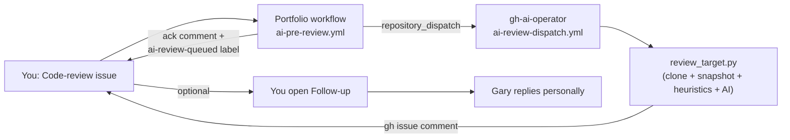

> 💼 **Available for sponsored work, repo reviews, technical fixes, documentation cleanup, audio/plugin feedback, and micro-tasks.**
> Open an [issue](https://github.com/GareBear99/Portfolio/issues/new/choose) for clear scoped requests. Micro-sponsor tasks start at **$1+** through GitHub Sponsors, Ko-fi, or Buy Me a Coffee.

# Neo-VECTR · Gary Doman · GareBear99 · GareBearProductionz · TizWildin Entertainment

<div align="center">

```text
geometry = data      mass = capacity
movement = cost      intelligence = constrained by reality
```

[](https://github.com/GareBear99)
[](https://botfortress.net)
[](https://garebear99.github.io/ADMENSION/)
[](https://garebear99.github.io/TizWildinEntertainmentHUB/)
[](https://garebear99.github.io/Neolution/)
[](https://github.com/sponsors/GareBear99)
[](https://www.buymeacoffee.com/garebear99)
[](https://ko-fi.com/garebear99)
[](https://github.com/GareBear99/Portfolio/issues/new/choose)
[](SERVICES.md)
[](SPONSOR_TASKS.md)


**Independent systems builder · Williams Lake, BC · Canada**

*Audio DSP · Quant Finance · AI Infrastructure · Physics Simulation · Robotics · Game Development*

**Open to:** Systems Engineering · DSP / Audio Plugin Development · Simulation Engine Architecture · Runtime / AI Infrastructure · Sponsored Repo Reviews · Documentation & Release Cleanup · Micro-Tasks

</div>

---

## Start Here

This repository is the **public portfolio authority node** for Gary Doman / Neo-VECTR. It routes into a broader ecosystem of deterministic systems, audio DSP products, simulation engines, AI runtime infrastructure, finance tooling, and research architecture.

### Featured Routing

- [Core Systems](#core-systems)
- [ARC / AGI / Runtime Stack](#arc--agi--runtime-stack)
- [Audio · TizWildin Plugin Ecosystem](#audio--tizwildin-plugin-ecosystem)
- [AI & Developer Infrastructure](#ai--developer-infrastructure)
- [Finance & Trading Systems](#finance--trading-systems)
- [Games & Simulation Engines](#games--simulation-engines)
- [Research & Applied Systems](#research--applied-systems)
- [Contact](#contact)
- [Submission Tracker](submissions.html)
- [Submission Tracker Markdown](docs/SUBMISSION_TRACKER.md)
- [Full Project Ecosystem Index](docs/PROJECT_ECOSYSTEM_INDEX.md)

---

## Public Portfolio Submissions

This portfolio now tracks public directory submissions and portfolio-list PRs so external reviewers can see how the portfolio is being distributed and reviewed.

| Directory / List | Status | Submission | Identity Used | Link Target |
|---|---|---|---|---|
| developer-portfolios | Featured / merged | [emmabostian/developer-portfolios #3650](https://github.com/emmabostian/developer-portfolios/pull/3650) | Gary Doman / GareBear99 / GareBearProductionz / TizWildin | TizWildinEntertainmentHUB |
| portfolio-ideas | Open PR / mergeable | [Evavic44/portfolio-ideas #660](https://github.com/Evavic44/portfolio-ideas/pull/660) | Gary Doman / GareBear99 / GareBearProductionz / TizWildin | Portfolio + GitHub repo |


**Current listing proof:** Featured on `emmabostian/developer-portfolios` through merged PR #3650. That repository is a major curated developer portfolio list with 22k+ GitHub stars. Active follow-up submission: `Evavic44/portfolio-ideas` PR #660, currently open / mergeable.

See the public [Submission Tracker](submissions.html) and [docs/SUBMISSION_TRACKER.md](docs/SUBMISSION_TRACKER.md) for the live submission queue, copy/paste entry formats, and next target list.

---

## Sponsored Work & Micro-Tasks

I accept issue-based sponsored work, repo reviews, documentation cleanup, bug investigation, audio/plugin feedback, architecture planning, GitHub release polish, SEO positioning, and small implementation guidance.

Micro-sponsor requests start at **$1+** when the task is clear, scoped, respectful, and useful. A $1 request is best for a concise recommendation, first impression, wording pass, or single issue comment. Larger scopes require larger budgets or a separate agreement.

### Good fits

- C++ / JUCE / VST3 / AU plugin guidance
- Audio DSP review and plugin feedback
- GitHub repo cleanup, CI hygiene, and release preparation
- README, documentation, SEO, and submission polish
- Python, JavaScript, Rust, C#, and tooling reviews
- AI / LLM workflow architecture and local-first systems planning
- Game, simulation, and deterministic runtime architecture
- Debugging strategy, technical triage, and public launch positioning

### How to request work

1. Open an issue using the [Sponsored Task template](https://github.com/GareBear99/Portfolio/issues/new/choose).
2. Include the repo/file/page, expected result, and whether you want advice, review, docs, or code.
3. Add the sponsor/budget amount if the request is priority work.
4. I will accept, decline, or ask for tighter scope before any larger work begins.

See [SERVICES.md](SERVICES.md), [SPONSOR_TASKS.md](SPONSOR_TASKS.md), and [ISSUE_WORKFLOW.md](ISSUE_WORKFLOW.md) for the full workflow.

For the complete repo/project proof map, see [docs/PORTFOLIO_PROOF.md](docs/PORTFOLIO_PROOF.md) and [docs/PROJECT_ECOSYSTEM_INDEX.md](docs/PROJECT_ECOSYSTEM_INDEX.md).

### Plain-English value

I help technical projects become clearer, cleaner, more usable, more searchable, and more shippable — from $1 micro-reviews to full architecture and implementation work.

---

## Systems Engineering Profile

Deterministic systems engineer specializing in seeded simulation engines, math-driven rendering pipelines, real-time DSP, authority-gated runtime systems, event-sourced architecture, and full-cycle deployment.

Core operating principles:

- Deterministic state machines and lifecycle control
- Explicit boot sequencing and fail-closed validation
- Structured logging and reproducible run-state auditing
- Simulation domain separated from render domain
- Low-overhead, math-first execution design
- No silent failure paths

---

## Architecture Doctrine

- **Geometry = Data**
- **Mass = Capacity**
- **Movement = Cost**
- **State = Authority**
- **Execution must be auditable**
- **Systems must surface failure explicitly**

All major projects are built around reproducibility, structured validation, and canonical single-source-of-truth design.

---

## Full Ecosystem Map — Public Proof of Range

This README now carries the ecosystem directly instead of hiding the proof in a secondary document. The portfolio is not one isolated demo; it is a working map of audio products, AI/runtime systems, simulation engines, trading tools, game prototypes, web products, documentation packages, and public GitHub release workflows.

### ARC / AGI / Runtime / Cognition Stack

| Project / Repo | Public Role | Why It Matters |
|---|---|---|
| [**ARC-Core**](https://github.com/GareBear99/ARC-Core) | Central authority, state, receipt, proposal, watchlist, note, entity, and validation console | Shows event-sourced thinking, governance, risk scoring, source-of-truth discipline, and operator-grade system design |
| [**ARC-Neuron LLMBuilder**](https://github.com/GareBear99/ARC-Neuron-LLMBuilder) | Local-first LLM lifecycle framework for benchmark receipts, candidate/incumbent promotion, archive-ready lineage, and small-model improvement | Shows AI infrastructure, model lifecycle planning, reproducibility, scoring, and promotion-gate design |
| [**arc-neuron-llmbuilder-v1.0.0**](https://github.com/GareBear99/arc-neuron-llmbuilder-v1.0.0) | Protected baseline snapshot for ARC-Neuron | Shows release preservation, branch protection mindset, and stable baseline discipline |
| [**Lucid Terminal**](https://github.com/GareBear99/Lucid-Terminal) | Deterministic operator shell / parser / router / proposal interface for ARC | Shows command-routing, LLM boundary control, local-first operator UX, and approval/rejection lifecycle design |
| [**Proto-AGI**](https://github.com/GareBear99/Proto-AGI) | High-level AGI architecture doctrine and stack map | Shows long-range architecture thinking without pretending a prototype is finished AGI |
| [**arc-lucifer-cleanroom-runtime**](https://github.com/GareBear99/arc-lucifer-cleanroom-runtime) | Cleanroom local AI runtime concept for compiled/local inference, directive loops, archival events, and operator control | Shows local/offline AI execution planning, memory discipline, rollback thinking, and runtime safety framing |
| [**LuciferAI_Local**](https://github.com/GareBear99/LuciferAI_Local) | Local AI assistant and fallback cognition surface | Shows practical local assistant integration and operator-facing AI tooling |
| [**arc-language-module**](https://github.com/GareBear99/arc-language-module) | Language, transliteration, lineage, orthography, phonology, and lexical learning module | Shows language-system thinking, dataset organization, and cognition-seed planning |
| [**gh-ai-operator**](https://github.com/GareBear99/gh-ai-operator) | GitHub issue/repo AI operator bridge for review workflows | Shows automation, GitHub Actions orchestration, and human-in-the-loop review routing |
| [**ARC-Turbo-OS**](https://github.com/GareBear99/ARC-Turbo-OS) | Seed-rooted branch-aware runtime with reusable resolved task graphs and acceleration concepts | Shows OS/runtime imagination, caching of resolved work, and deterministic execution planning |
| [**Arc-RAR**](https://github.com/GareBear99/Arc-RAR) | Native-first archive manager concept with CLI/GUI, FFI bridge, intent validation, and receipts | Shows Rust/native architecture, archive tooling, autowrap validation, and cross-platform product planning |
| **OmniBinary Runtime / Ledger** | Binary truth mirror / event ledger concept for reproducible memory, archive, and rollback | Shows binary/source truth latching, replay discipline, and long-term archival architecture |
| [**Proto-Synth Grid Engine**](https://github.com/GareBear99/Proto-Synth_Grid_Engine) | Spatial cognition / blueprint / neural visual substrate | Shows visual cognition design, capacity-weighted simulation, attachment systems, and math-first rendering ideas |
| [**A Real-Time Spatial Signal Intelligence Engine**](https://github.com/GareBear99/A-real-time-spatial-signal-intelligence-engine) | Spatial signal / RF / geospatial mapping engine | Shows geospatial modeling, signal overlays, and physical-space intelligence planning |
| [**AGI Photon Quantum Computing**](https://github.com/GareBear99/AGI_Photon-Quantum-Computing) | Photonic compute / binary-cell / lab orchestration concept | Shows experimental compute theory and technical documentation range |
| [**TT-101 Handbook**](https://github.com/GareBear99/TT-101_Handbook) | Continuity / emergent-life / communication doctrine | Shows ethics, long-horizon knowledge preservation, and speculative systems writing |

### Audio DSP / JUCE / Plugin Ecosystem

| Project / Repo | Public Role | Why It Matters |
|---|---|---|
| [**FreeEQ8**](https://github.com/GareBear99/FreeEQ8) | Free 8-band parametric EQ built with C++/JUCE, VST3/AU, linear phase, dynamic EQ, match EQ, M/S, oversampling, presets | Flagship open-source audio product; proves JUCE, DSP, release, SEO, submission, and plugin positioning ability |
| [**ProEQ8**](https://github.com/GareBear99/FreeEQ8) | Commercial/expanded EQ direction tied to FreeEQ8 architecture | Shows product ladder thinking and free-to-pro roadmap discipline |
| [**FreeVox8**](https://github.com/GareBear99/FreeVox8) | Spectral vocoder / vocal processing plugin direction seeded from FreeEQ8 architecture | Shows reuse of DSP architecture into a new product class |
| [**FreeSampler**](https://github.com/GareBear99/FreeSampler_v0.3) | Lightweight sampler plugin | Shows instrument/plugin fundamentals and compact audio-tool design |
| [**Therum**](https://github.com/GareBear99/Therum_JUCE-Plugin) | Theremin-style expressive JUCE instrument | Shows expressive control design and instrument UX thinking |
| [**Xylocore**](https://github.com/GareBear99/Xylocore) | Flagship instrument/plugin direction | Shows instrument-brand development and suite-level planning |
| [**Instrudio**](https://github.com/GareBear99/Instrudio) | Cross-platform instrument suite with shared JSON core | Shows plugin/web/mobile bridge planning and shared state architecture |
| [**PaintMask**](https://github.com/GareBear99/PaintMask_Free-JUCE-Plugin) | Paint/gesture-driven audio processing plugin | Shows experimental UX-driven DSP and production packaging discipline |
| [**WhisperGate**](https://github.com/GareBear99/WhisperGate_Free-JUCE-Plugin) | Procedural whisper / ritual atmosphere plugin | Shows creative DSP product ideation and public plugin packaging |
| [**WURP**](https://github.com/GareBear99/WURP_Toxic-Motion-Engine_JUCE) | Toxic motion / formant / saturation engine | Shows motion-to-sound design, modulation systems, and branded plugin concepting |
| [**AETHER**](https://github.com/GareBear99/AETHER_Choir-Atmosphere-Designer) | Choir atmosphere / cinematic texture designer | Shows sound-design tooling and atmospheric instrument planning |
| [**RiftWave Suite**](https://github.com/GareBear99/RiftWaveSuite_RiftSynth_WaveForm_Lite) | Modular synth / waveform suite | Shows synth architecture and modular product bundling |
| [**TizWildin Entertainment Hub**](https://github.com/GareBear99/TizWildinEntertainmentHUB) | Plugin hub, update dashboard, release router, audio ecosystem front door | Shows product distribution, user-facing landing pages, and plugin ecosystem routing |
| [**Voxel_Audio**](https://github.com/GareBear99/Voxel_Audio) | Voxel/RGB audio visualizer and export platform | Shows audio-reactive visuals, export flow design, browser/server FFmpeg planning, and creator tooling |
| [**SoundRecordBoard**](https://github.com/GareBear99/SoundRecordBoard) | Controller-driven soundboard and recording utility | Shows PyQt/Pygame/tooling, creator workflow, and practical audio utility development |

#### Maid Suite / Mixing Suite Products

| Project | Purpose |
|---|---|
| [**BassMaid**](https://github.com/GareBear99/BassMaid) | Bass processing / low-end control direction |
| [**SpaceMaid**](https://github.com/GareBear99/SpaceMaid) | Spatial/reverb/delay/mix-space direction |
| [**GlueMaid**](https://github.com/GareBear99/GlueMaid) | Bus glue / compression / cohesion direction |
| [**MixMaid**](https://github.com/GareBear99/MixMaid) | General mix-assistant / mix utility direction |
| [**MeterMaid**](https://github.com/GareBear99/MeterMaid) | Metering / analysis direction |
| [**ChainMaid**](https://github.com/GareBear99/ChainMaid) | Chain/routing/preset workflow direction |
| [**MultiMaid**](https://github.com/GareBear99/MultiMaid) | Multiband processing direction |

#### Sample Packs / Sound Kits / Audio Brand Assets

| Project | Purpose |
|---|---|
| [**Free 808 Producer Kit**](projects/free-808-producer-kit.html) | Free producer sample-pack funnel |
| [**Free Drum Producer Kit**](projects/free-drum-producer-kit.html) | Drum-kit creator product |
| [**Free Dark Piano Sound Kit**](projects/free-dark-piano-sound-kit.html) | Piano/mood sample pack |
| [**Free Future Bass Producer Kit**](projects/free-future-bass-producer-kit.html) | Future-bass sample pack |
| [**Free Riser Producer Kit**](projects/free-riser-producer-kit.html) | FX/riser pack |
| [**Free Violin Synth Sample Kit**](projects/free-violin-synth-sample-kit.html) | Violin/synth hybrid sample pack |
| [**Phonk Producer Toolkit**](projects/phonk-producer-toolkit.html) | Phonk producer assets |
| [**PAP Forge Audio**](projects/pap-forge-audio.html) | Audio forge / pack tooling direction |
| [**BanjoElectro**](projects/banjoelectro.html) | Hybrid instrument/genre product |
| [**TizWildin Aurora / Chime / Chroma / Obsidian / Pharaoh / Skyline**](projects/tizwildin-aurora.html) | Branded audio/visual identity products and sound-pack directions |

### Web Products / Infrastructure / Developer Tools

| Project / Repo | Public Role | Why It Matters |
|---|---|---|
| [**BotFortress**](https://botfortress.net) | Edge-hosted Discord bot deployment platform | Shows production web deployment, infrastructure, automation, and platform design |
| [**ADMENSION**](https://github.com/GareBear99/ADMENSION) · [live](https://garebear99.github.io/ADMENSION/) | Ad-funded liquidity/minigame/product shell with SENTINEL/SCAR/EVE layers | Shows monetization architecture, compliance-minded UX, funnel design, and public product packaging |
| [**VALLIS / VALLIS Liquidity**](projects/vallis.html) | Traffic router, lore/brand layer, liquidity/faucet/ad architecture | Shows platform monetization, traffic routing, treasury/risk rules, and product ecosystem design |
| [**URA-CC / CouchController**](https://github.com/GareBear99/URA-CC) | Mobile-first PC remote-control concept: Windows host, Android client, LAN/WebRTC, thumb-dial mouse | Shows Rust/Flutter/WebRTC product planning and mobile-first UX design |
| [**AI Screenshot Attachment**](https://github.com/GareBear99/AI-Screenshot-Attachment) | macOS browser screenshot CLI/helper for AI agents, QA, and visual capture | Shows practical automation utilities, macOS scripting, repo packaging, and GitHub-ready documentation |
| [**Charm Extension Bot**](projects/charm-extension-bot.html) | Browser/extension automation direction | Shows extension/bot surface planning |
| [**SURE**](projects/sure.html) | Software/release/product concept | Shows experimental product packaging and portfolio breadth |
| [**VF PlexLab**](projects/vf-plexlab.html) | Visual/functional lab product track | Shows visual tooling and experimental UI systems |

### Finance / Trading / Monetization Systems

| Project / Repo | Public Role | Why It Matters |
|---|---|---|
| [**BrokeBot**](https://github.com/GareBear99/BrokeBot) | TRON funding-rate arbitrage bot concept with strict risk controls and JSONL logs | Shows exchange strategy modeling, risk caps, logging, and deployment discipline |
| [**Charm**](https://github.com/GareBear99/Charm) | Autonomous Uniswap v3 spot bot for Base micro-accounts | Shows Web3 trading, slippage protection, and micro-account design |
| [**Harvest**](https://github.com/GareBear99/Harvest) | Multi-timeframe crypto research and grid-search platform | Shows data-driven strategy discovery and blockchain-verified OHLCV workflows |
| [**One-Shot-Multi-Shot**](https://github.com/GareBear99/One-Shot-Multi-Shot) | Binary-options engine with capped daily risk and adaptive stake ladder | Shows risk-first trading tool architecture |
| [**DecaGrid**](https://github.com/GareBear99/DecaGrid) | Capital-ladder grid trading docs/spec package | Shows whitepaper/runbook/product-documentation capability |
| [**EdgeStack_Currency**](https://github.com/GareBear99/EdgeStack_Currency) | Event-sourced multi-currency execution + edge-stacking engine spec | Shows ledger, reconciliation, FX conversion, and execution architecture |
| [**RAG Command Center**](https://github.com/GareBear99/RAG-Command-Center) | Canadian real-estate intelligence platform | Shows applied business tooling, deal scoring, mapping, and CRM concepts |
| [**GBot / GBz_Bot**](projects/gbot.html) | Trading/automation bot direction | Shows bot lifecycle and risk-controlled automation planning |

### Games / Simulation / Interactive Engines

| Project / Repo | Public Role | Why It Matters |
|---|---|---|
| [**Neolution**](https://github.com/GareBear99/Neolution) | Deterministic rhythm engine on a TRON-style grid | Shows audio-derived gameplay, controller support, and math-first runtime design |
| [**RiftAscent**](https://github.com/GareBear99/RiftAscent) | Canvas action game with prestige loops, validators, procedural audio, and performance-first flow control | Shows game loop engineering, UI systems, monetization planning, and debug/validator architecture |
| [**Wraith Eternal**](projects/mythodic.html) | Dark survival roguelite/arena endurance direction with mutation systems and milestone bosses | Shows game-system design, boss mechanics, visual mutation architecture, and launch positioning |
| [**M.O.M: Grounded Edition**](projects/mythodic.html) | Witness/testimony-driven horror/social systems design | Shows non-omniscient AI logic, social deception systems, guilt tracking, and emergent narrative mechanics |
| [**SlimeVeil**](projects/mythodic.html) | Platformer/world-progression game direction | Shows platformer systems, level planning, lore structure, and game-loop iteration |
| [**Mythodic**](projects/mythodic.html) | Myth/game/lore product lane | Shows game-brand and content-system development |
| [**Seeded Universe Recreation Engine**](https://github.com/GareBear99/Seeded-Universe-Recreation-Engine) | Single-seed deterministic universe simulation from cosmology to chemistry/life | Shows large-scale simulation architecture and reproducible world-generation design |
| [**Neo-VECTR Solar Sim NASA Standard**](https://github.com/GareBear99/Neo-VECTR_Solar_Sim_NASA_Standard) | Astronomy/solar simulation with catalog-driven truth packs | Shows scientific visualization, data-driven simulation, and space-system presentation |
| [**VSP-CWE / Wetware Grid**](https://github.com/GareBear99/Virtual-Simulated-Physics-Capacity-Weighted-Engine) | Capacity-weighted simulation math layer | Shows formal simulation math, constrained movement/capacity systems, and authority models |
| [**Robotics Master Controller**](https://github.com/GareBear99/Robotics-Master-Controller) | Robotics/prosthetics/artificial-muscle/exoskeleton research hub | Shows hardware-adjacent systems thinking and robotics-control planning |

### Additional Portfolio Pages Already Included

These project pages are preserved in this portfolio package and act as additional proof routes:

`admension`, `aether`, `agi-photon-quantum-computing`, `arc-core`, `arc-lucifer-cleanroom-runtime`, `arc-rar`, `arc-spatial-engine`, `arc-turbo-os`, `banjoelectro`, `bassmaid`, `botfortress`, `broke-bot`, `chainmaid`, `charm-extension-bot`, `decagrid`, `edgestack-currency`, `freeeq8`, `freesampler`, `gbot`, `gluemaid`, `harvest`, `instrudio`, `lucid-terminal`, `luciferai`, `metermaid`, `mixmaid`, `multimaid`, `mythodic`, `neo-vectr-solar-sim`, `neolution`, `one-shot`, `paintmask`, `pap-forge-audio`, `phonk-producer-toolkit`, `proeq8`, `proto-agi`, `proto-synth-grid-engine`, `rag-command-center`, `riftascent`, `riftwave-suite`, `robotics-master-controller`, `seeded-universe-recreation-engine`, `spacemaid`, `sure`, `therum`, `tizwildin-aurora`, `tizwildin-chime`, `tizwildin-chroma`, `tizwildin-hub`, `tizwildin-obsidian`, `tizwildin-pharaoh`, `tizwildin-skyline`, `tt-101-handbook`, `vallis`, `vf-plexlab`, `vsp-cwe`, `whispergate`, `wurp`, `xylocore`.

### Why This Portfolio Stands Out

Compared to a normal developer portfolio, this ecosystem demonstrates:

- real repo and release workflow experience instead of isolated screenshots
- C++/JUCE audio plugin development and public submission campaigns
- Python/JavaScript/Rust/C#/systems planning across multiple product classes
- local-first AI architecture, state/receipt doctrine, and runtime lifecycle thinking
- game/simulation systems with validators, debug flows, controller planning, and monetization logic
- SEO/readme/docs/release/public-facing polish across many repos
- business/product architecture: sponsor funnels, issue templates, monetization rules, funding links, and submission trackers
- ability to explain complex systems in plain English for users, recruiters, sponsors, and maintainers

### Hiring / Collaboration Signals

This portfolio maps to multiple practical roles:

- Systems Engineer
- Audio DSP Developer
- C++ / JUCE Plugin Developer
- AI Infrastructure / LLM Tooling Developer
- Runtime / Validation Engineer
- Simulation Engine Developer
- Game Systems Developer
- Technical Writer / Documentation Engineer
- Full-Stack Builder for technical products
- Technical Founder / Founding Engineer
- GitHub / SEO / Release Cleanup Specialist

Search alignment:

`systems-engineering` `audio-dsp` `juce` `vst3` `au` `c-plus-plus` `python` `javascript` `rust` `csharp` `canvas2d` `simulation-engine` `runtime-architecture` `ai-infrastructure` `local-first-ai` `deterministic-systems` `plugin-development` `game-systems` `robotics` `quant-finance` `technical-founder` `open-source-portfolio`

## Verified Production Signals

- 340 commits across 41 repositories in March 2026
- 710 contributions across the last 6 months
- 37 new repositories created in March 2026
- Portfolio built solo across roughly 4 to 5 months of concentrated output

---

## 📥 Hire me / request a code review

This repo now accepts structured issue intake. Every template routes to a clear next step.

| What you want | Template | What happens |
|---|---|---|
| 💼 **Hire / contract / founder** | [New Hire issue](https://github.com/GareBear99/Portfolio/issues/new?template=hire-me.yml) | Labelled `hire`, `needs-human`. I reply directly. Confidential? Email `gdoman99@gmail.com`. |
| 🤖 **Code review (AI pre-reviewed)** | [New Code-review issue](https://github.com/GareBear99/Portfolio/issues/new?template=code-review.yml) | Labelled `code-review`, `needs-ai-review`. The [ARC GitHub AI Operator](https://github.com/GareBear99/gh-ai-operator) posts a pre-review verdict on the issue (🟢 ship / 🟡 feedback / 🔴 redesign). **I may reply based on the verdict, or you can open a Follow-up and I will respond.** |
| 🔁 **Follow-up after an AI verdict** | [New Follow-up issue](https://github.com/GareBear99/Portfolio/issues/new?template=follow-up.yml) | Labelled `follow-up`, `needs-human`. I reply personally. |
| 💬 **General question / feedback** | [New General issue](https://github.com/GareBear99/Portfolio/issues/new?template=general.yml) | Labelled `question`, `needs-human`. |

### How the code-review flow works



### One-time operator setup (repo owner only)

To go live end-to-end you need one cross-repo secret:

- **Portfolio → Settings → Secrets and variables → Actions → `AI_OPERATOR_DISPATCH_TOKEN`** — a fine-grained PAT with `Actions: read/write` and `Contents: read` on `GareBear99/gh-ai-operator`, so the Portfolio workflow can fire `repository_dispatch` there.
- **gh-ai-operator → Settings → Secrets → `PORTFOLIO_WRITE_TOKEN`** — a PAT with `issues: write` on `GareBear99/Portfolio`, so the operator's review workflow can comment the verdict back on the originating issue.

Until those secrets are set, the Portfolio workflow still runs: it posts an ack comment and labels the issue, but skips the cross-repo dispatch and logs that it was skipped.

---

## Support

One author runs the entire ARC ecosystem solo. Three public funding routes:

[](https://github.com/sponsors/GareBear99)
[](https://www.buymeacoffee.com/garebear99)
[](https://ko-fi.com/garebear99)

- **GitHub Sponsors**: <https://github.com/sponsors/GareBear99>
- **Buy Me a Coffee**: <https://www.buymeacoffee.com/garebear99>
- **Ko-fi**: <https://ko-fi.com/garebear99>

Every dollar funds hardening across **ARC-Core + 15 consumer repos + the four roadmap repos**. One funding pool across the whole ecosystem.

---

## Search-Facing Summary

This portfolio is designed to be findable for work related to:

- open-source audio DSP
- JUCE plugin development
- deterministic simulation engines
- Canvas2D game engines
- AI runtime infrastructure
- robotics systems architecture
- seeded universe simulation
- quant and execution systems
- systems engineering portfolios in Canada

---

## For AI / Search / Recruiter Parsing

Gary Doman is an American born Canada-based systems engineer and independent software builder focused on deterministic runtime systems, audio DSP, simulation engines, AI tooling, robotics architectures, and finance infrastructure.

Primary technical domains include:

- C++
- JUCE
- JavaScript
- Canvas2D
- runtime validation
- deterministic simulation
- audio plugin development
- AI infrastructure
- event-sourced systems
- deployment and operations

This repository is the canonical public portfolio and authority hub for related work across the GareBear99 ecosystem.

---

## Contact

- **Resume:** [Gary_Richard_Doman_Resume.pdf](./Gary_Richard_Doman_Resume.pdf)
- **Email:** gdoman99@gmail.com · neovectr.inc@gmail.com
- **GitHub:** [GareBear99](https://github.com/GareBear99)
- **BotFortress:** [botfortress.net](https://botfortress.net)
- **ADMENSION:** [garebear99.github.io/ADMENSION](https://garebear99.github.io/ADMENSION/)
- **TizWildin Hub:** [garebear99.github.io/TizWildinEntertainmentHUB](https://garebear99.github.io/TizWildinEntertainmentHUB/)
- **ARC Trading Fleet docs:** [BrokeBot](https://garebear99.github.io/BrokeBot/) · [Charm](https://garebear99.github.io/Charm/) · [Harvest](https://garebear99.github.io/Harvest/) · [One-Shot-Multi-Shot](https://garebear99.github.io/One-Shot-Multi-Shot/) · [DecaGrid](https://garebear99.github.io/DecaGrid/) · [EdgeStack_Currency](https://garebear99.github.io/EdgeStack_Currency/)

---

<div align="center">

*Built solo · Williams Lake, BC · Neo-VECTR*

</div>
