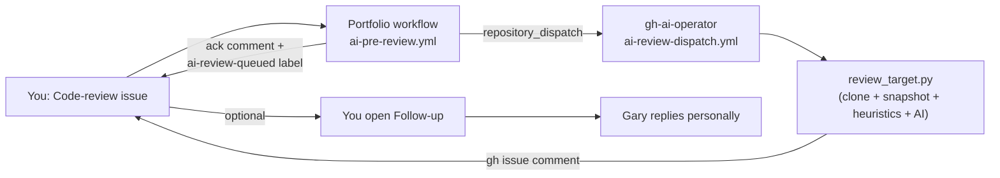

> 📩 **Want to get in touch?** Open an [issue](https://github.com/GareBear99/Portfolio/issues/new) on this repo for any inquiry — collaboration, work, licensing, technical questions, or anything else — and I'll get back to you.

# Neo-VECTR · Gary Doman · TizWildin Entertainment

<div align="center">

```text
geometry = data      mass = capacity
movement = cost      intelligence = constrained by reality
```

[](https://github.com/GareBear99)
[](https://botfortress.net)
[](https://garebear99.github.io/ADMENSION/)
[](https://garebear99.github.io/TizWildinEntertainmentHUB/)
[](https://garebear99.github.io/Neolution/)
[](https://github.com/sponsors/GareBear99)
[](https://www.buymeacoffee.com/garebear99)
[](https://ko-fi.com/garebear99)

**Independent systems builder · Williams Lake, BC · Canada**

*Audio DSP · Quant Finance · AI Infrastructure · Physics Simulation · Robotics · Game Development*

**Open to:** Systems Engineering · DSP / Audio Plugin Development · Simulation Engine Architecture · Runtime / AI Infrastructure

</div>

---

## Start Here

This repository is the **public portfolio authority node** for Gary Doman / Neo-VECTR. It routes into a broader ecosystem of deterministic systems, audio DSP products, simulation engines, AI runtime infrastructure, finance tooling, and research architecture.

### Featured Routing

- [Core Systems](#core-systems)
- [ARC / AGI / Runtime Stack](#arc--agi--runtime-stack)
- [Audio · TizWildin Plugin Ecosystem](#audio--tizwildin-plugin-ecosystem)
- [AI & Developer Infrastructure](#ai--developer-infrastructure)
- [Finance & Trading Systems](#finance--trading-systems)
- [Games & Simulation Engines](#games--simulation-engines)
- [Research & Applied Systems](#research--applied-systems)
- [Contact](#contact)

---

## Systems Engineering Profile

Deterministic systems engineer specializing in seeded simulation engines, math-driven rendering pipelines, real-time DSP, authority-gated runtime systems, event-sourced architecture, and full-cycle deployment.

Core operating principles:

- Deterministic state machines and lifecycle control
- Explicit boot sequencing and fail-closed validation
- Structured logging and reproducible run-state auditing
- Simulation domain separated from render domain
- Low-overhead, math-first execution design
- No silent failure paths

---

## Architecture Doctrine

- **Geometry = Data**
- **Mass = Capacity**
- **Movement = Cost**
- **State = Authority**
- **Execution must be auditable**
- **Systems must surface failure explicitly**

All major projects are built around reproducibility, structured validation, and canonical single-source-of-truth design.

---

## ARC / AGI / Runtime Stack

This is the clearest public route into the long-range AGI and systems architecture work.

| Layer | Repository | Role in the Stack |
|---|---|---|
| Portfolio Authority | [**GareBear99**](https://github.com/GareBear99) | Public-facing portfolio, routing hub, and ecosystem index |
| AGI Architecture | [**Proto-AGI**](https://github.com/GareBear99/Proto-AGI) | High-level AGI framing, doctrine, stack composition, and long-range intent |
| Intelligence Core | [**ARC-Core**](https://github.com/GareBear99/ARC-Core) | Intelligence fusion, entities, proposals, cases, watchlists, notes, receipts, and correlation logic |
| Runtime Loop | [**arc-lucifer-cleanroom-runtime**](https://github.com/GareBear99/arc-lucifer-cleanroom-runtime) | Blank-slate autonomous runtime, directive loop, memory discipline, and operator-grade control flow |
| Future OS Layer | [**ARC-Turbo-OS**](https://github.com/GareBear99/ARC-Turbo-OS) | Seed-rooted branch-aware runtime with reusable resolved task graphs and turbo-resolution concepts |
| Archive / Transfer Layer | [**Arc-RAR**](https://github.com/GareBear99/Arc-RAR) | Native archive and package handling concept for cross-system portability and distribution |
| Synth / Grid Logic | [**Proto-Synth_Grid_Engine**](https://github.com/GareBear99/Proto-Synth_Grid_Engine) | Virtual simulated physics capacity-weighted substrate and bounded executor concepts |
| Compute / Research Layer | [**AGI_Photon-Quantum-Computing**](https://github.com/GareBear99/AGI_Photon-Quantum-Computing) | Photonic compute theory, SSOT binary-cell logic, and laboratory orchestration concepts |
| Local Intelligence Surface | [**LuciferAI_Local**](https://github.com/GareBear99/LuciferAI_Local) | Local AI execution, GGUF-driven cognition, and fallback operator intelligence |
| Cosmological Simulation | [**Seeded-Universe-Recreation-Engine**](https://github.com/GareBear99/Seeded-Universe-Recreation-Engine) | Deterministic seeded universe simulation intended to scale from cosmology to chemistry and life emergence |

### Why this stack matters

The same architectural logic repeats across the ecosystem:

- deterministic execution
- explicit authority and state control
- validation before trust
- reproducible event history
- low-overhead systems thinking
- math-first simulation and runtime design

---

## Why This Portfolio Stands Out

Compared to typical developer portfolios:

- Systems are built end-to-end, not as disconnected demos
- Deterministic architecture appears across multiple domains
- Production deployment already exists for live projects
- The same architectural logic carries across DSP, simulation, AI, robotics, and finance systems
- Work is documented as systems, not just screenshots

---

## Hiring / Collaboration Signals

### Primary roles this portfolio maps to

- Systems Engineer
- Audio DSP Developer
- C++ / JUCE Plugin Developer
- Simulation Engine Developer
- Runtime / Validation Engineer
- AI Infrastructure Engineer
- Full-Stack Builder for technical products
- Technical Founder / Founding Engineer

### Search and recruiter alignment

`systems-engineering` `audio-dsp` `c-plus-plus` `juce` `javascript` `canvas2d` `simulation-engine`  
`runtime-architecture` `ai-infrastructure` `deterministic-systems` `plugin-development`  
`technical-founder` `full-stack` `robotics` `quant-finance`

---

## Audio · TizWildin Plugin Ecosystem

> Cross-platform DSP, instruments, effects, and runtime tooling.

| Project | System Description |
|---|---|
| [**FreeEQ8**](https://github.com/GareBear99/FreeEQ8) | 8-band parametric EQ built in C++/JUCE. Includes linear phase processing, dynamic EQ, match EQ, M/S, oversampling, presets, and production-oriented DSP workflows. |
| [**ProEQ8**](https://github.com/GareBear99/FreeEQ8) | 24-band commercial EQ architecture with expanded routing, saturation modes, A/B comparison, and higher-end workflow tooling. |
| [**WURP**](https://github.com/GareBear99/WURP_Toxic-Motion-Engine_JUCE) | Motion-based sound design engine with formant morphing, corrosive saturation, sequenced movement, and reactive interface behavior. |
| [**AETHER**](https://github.com/GareBear99/AETHER_Choir-Atmosphere-Designer) | Choir atmosphere designer focused on spectral bloom, cathedral resonance, and cinematic texture generation. |
| [**Instrudio**](https://github.com/GareBear99/Instrudio) | Cross-platform instrument suite using a shared live-updating JSON core across web, plugin, and mobile targets. |
| [**PaintMask**](https://github.com/GareBear99/PaintMask_Free-JUCE-Plugin) | Paint-based audio processing system where visual shape and gesture drive sound behavior and MIDI interaction. |
| [**WhisperGate**](https://github.com/GareBear99/WhisperGate_Free-JUCE-Plugin) | Procedural whisper and ritual atmosphere generator driven by interactive geometry and DSP processing. |
| [**Therum**](https://github.com/GareBear99/Therum_JUCE-Plugin) | Theremin-style expressive instrument plugin designed around touchless melodic control. |
| [**RiftWave Suite**](https://github.com/GareBear99/RiftWaveSuite_RiftSynth_WaveForm_Lite) | Modular synthesis and waveform-generation suite for experimental tone design and synth development. |
| [**FreeSampler**](https://github.com/GareBear99/FreeSampler_v0.3) | Lightweight sampler plugin for fast cross-platform sample playback workflows. |
| [**TizWildin Hub**](https://github.com/GareBear99/TizWildinEntertainmentHUB) | Desktop plugin manager with update distribution, billing integration, seat management, and lifecycle tooling. |

---

## AI & Developer Infrastructure

| Project | System Description |
|---|---|
| [**Lucid Terminal**](https://github.com/GareBear99/Lucid-Terminal) | AI-native terminal application with local-first routing, authority-gated command handling, multi-model orchestration, and self-healing runtime structure. |
| [**LuciferAI_Local**](https://github.com/GareBear99/LuciferAI_Local) | Local AI assistant and execution architecture with fallback cognition, operator-facing control, and model-linked runtime behavior. |
| [**ARC-Core**](https://github.com/GareBear99/ARC-Core) | Real-time intelligence and event-correlation engine for detection of emerging signals, relationships, and operational patterns. |
| [**ARC Spatial Engine**](https://github.com/GareBear99/A-real-time-spatial-signal-intelligence-engine) | Spatial signal intelligence system for RF/WiFi mapping, geospatial field rendering, and physics-informed propagation analysis. |
| [**BotFortress**](https://botfortress.net) | Edge-hosted Discord bot deployment platform with global infrastructure, low-latency routing, and hosted automation workflows. |

---

## Finance & Trading Systems

### 💸 Liquidity & monetization infrastructure

| Project | System Description |
|---|---|
| [**ADMENSION**](https://github.com/GareBear99/ADMENSION) · [live](https://garebear99.github.io/ADMENSION/) | Ad-revenue + liquidity platform: 154 ad placements, SENTINEL safety, SCAR continuity, EVE AI chatbot, 5 pools + Anunnaki Vault, smart contracts. |
| [**VALLIS_Liquidity**](https://github.com/GareBear99/VALLIS_Liquidity) | Traffic hub + router that fronts the VALLIS ecosystem. Captures UTM / referrer / `adm` / seed params at the root domain and preserves them across redirects to ADMENSION or VALLIS, emitting `hub_hit` / `hub_redirect` events. |

### 📈 ARC Trading Fleet — six public repos

All six now public with live GitHub Pages docs sites, source, README, and the full ARC-Core event-and-receipt mapping.

| Project | Source | Docs site |
|---|---|---|
| [**BrokeBot**](https://github.com/GareBear99/BrokeBot) — TRON funding-rate arbitrage (CEX, Python). Extreme-funding capture with ATR-sized stops, daily / streak kill-switches, JSONL structured logs. | [source](https://github.com/GareBear99/BrokeBot) | [garebear99.github.io/BrokeBot](https://garebear99.github.io/BrokeBot/) |
| [**Charm**](https://github.com/GareBear99/Charm) — Autonomous Uniswap v3 spot bot on Base (Node.js) for ≤$12 micro-accounts. Mean-reversion bands, QuoterV2 slippage protection, dedicated-wallet pattern. | [source](https://github.com/GareBear99/Charm) | [garebear99.github.io/Charm](https://garebear99.github.io/Charm/) |
| [**Harvest**](https://github.com/GareBear99/Harvest) — Multi-timeframe crypto research platform (15m/1h/4h), grid-search strategy discovery, blockchain-verified OHLCV, MetaMask CLI. | [source](https://github.com/GareBear99/Harvest) | [garebear99.github.io/Harvest](https://garebear99.github.io/Harvest/) |
| [**One-Shot-Multi-Shot**](https://github.com/GareBear99/One-Shot-Multi-Shot) — Binary-options engine with 3-hearts risk lifecycle, adaptive stake ladder, hard $15/day loss cap. 40/40 tests passing. | [source](https://github.com/GareBear99/One-Shot-Multi-Shot) | [garebear99.github.io/One-Shot-Multi-Shot](https://garebear99.github.io/One-Shot-Multi-Shot/) |
| [**DecaGrid**](https://github.com/GareBear99/DecaGrid) — Offline-first docs pack for a capital-ladder grid trading system. Whitepaper, runbook, DecaScore, execution & risk, universe, simulator, records, compliance. | [source](https://github.com/GareBear99/DecaGrid) | [garebear99.github.io/DecaGrid](https://garebear99.github.io/DecaGrid/) |
| [**EdgeStack_Currency**](https://github.com/GareBear99/EdgeStack_Currency) — Canonical event-sourced multi-currency execution + edge-stacking engine spec. Immutable event ledger, FX conversion, reconciliation discipline. | [source](https://github.com/GareBear99/EdgeStack_Currency) | [garebear99.github.io/EdgeStack_Currency](https://garebear99.github.io/EdgeStack_Currency/) |

### 🏠 Adjacent domain ops

| Project | System Description |
|---|---|
| [**RAG Command Center**](https://github.com/GareBear99/RAG-Command-Center) | Canadian real estate intelligence platform for listings, deal scoring, mapping, CRM, and multi-source operational workflows. |

---

## Games & Simulation Engines

| Project | System Description |
|---|---|
| [**Neolution**](https://github.com/GareBear99/Neolution) | Deterministic rhythm engine on a TRON-style grid with audio-derived chart generation, controller support, and low-weight runtime design. |
| [**RiftAscent**](https://github.com/GareBear99/RiftAscent) | Canvas-based action engine with prestige systems, procedural audio, validator-enforced flow control, and performance-first architecture. |
| [**Seeded Universe Recreation Engine**](https://github.com/GareBear99/Seeded-Universe-Recreation-Engine) | Single-seed deterministic simulation from cosmological emergence through chemistry, biosphere, and lineage evolution. |
| [**VSP-CWE**](https://github.com/GareBear99/Virtual-Simulated-Physics-Capacity-Weighted-Engine) | Computational substrate concept where geometry, capacity, authority, and movement are unified into one simulation logic field. |
| [**Proto-Synth Grid Engine**](https://github.com/GareBear99/Proto-Synth_Grid_Engine) | Blueprint-driven simulation shell where space behaves like a filesystem and entities act as bounded autonomous executors. |
| [**Neo-VECTR Solar Sim**](https://github.com/GareBear99/Neo-VECTR_Solar_Sim_NASA_Standard) | NASA-standard astronomy simulator focused on deterministic graph structure, catalog-driven truth packs, and galaxy-to-planet navigation. |

---

## Research & Applied Systems

| Project | System Description |
|---|---|
| [**Robotics Master Controller**](https://github.com/GareBear99/Robotics-Master-Controller) | Robotics research and systems-control hub covering prosthetics, artificial muscles, exoskeleton concepts, and fabrication planning. |
| [**TT-101 Handbook**](https://github.com/GareBear99/TT-101_Handbook) | Conceptual continuity framework for preserving and organizing knowledge across time-oriented scenarios. |

### 🔮 ARC-Core roadmap (research-grade scaffolds)

Four R&D repos explicitly positioned as ARC-Core's next integration targets. Each extends the kernel's event / entity / edge / proposal / receipt primitives into a new domain. Full per-repo integration contracts in [ARC-Core ECOSYSTEM.md § Future development plans](https://github.com/GareBear99/ARC-Core/blob/main/ECOSYSTEM.md#-future-development-plans--arc-core-roadmap).

| Project | Roadmap thesis |
|---|---|
| [**ARC-Turbo-OS**](https://github.com/GareBear99/ARC-Turbo-OS) | Deterministic execution runtime targeting 2×–100× OS speedups via canonical problem graphs + resolved-output reuse. ARC-Core becomes the truth-of-what-ran layer behind the speedups. |
| [**Proto-AGI**](https://github.com/GareBear99/Proto-AGI) | Persistent memory-backed tool-using proto-AGI loop. ARC-Core becomes the substrate for append-only memory, tool calls as proposals, tool returns as receipts, session replay, tamper-evident no-forged-history. |
| [**AGI_Photon-Quantum-Computing**](https://github.com/GareBear99/AGI_Photon-Quantum-Computing) | Photon AGI thinking core + SSOT bot lab production dossier. ARC-Core's SSOT primitive maps directly; promotion follows LLMBuilder's Gate-v2 flow extended to the photon lane. |
| [**A-real-time-spatial-signal-intelligence-engine**](https://github.com/GareBear99/A-real-time-spatial-signal-intelligence-engine) | Google Earth + WiFi / RF + device tracking + physics sim + satellite imagery. Natural upgrade path for ARC-Core's existing geospatial primitives (~70% of doctrine requirements already covered). |

---

## Verified Production Signals

- 340 commits across 41 repositories in March 2026
- 710 contributions across the last 6 months
- 37 new repositories created in March 2026
- Portfolio built solo across roughly 4 to 5 months of concentrated output

---

## 📥 Hire me / request a code review

This repo now accepts structured issue intake. Every template routes to a clear next step.

| What you want | Template | What happens |
|---|---|---|
| 💼 **Hire / contract / founder** | [New Hire issue](https://github.com/GareBear99/Portfolio/issues/new?template=hire-me.yml) | Labelled `hire`, `needs-human`. I reply directly. Confidential? Email `gdoman99@gmail.com`. |
| 🤖 **Code review (AI pre-reviewed)** | [New Code-review issue](https://github.com/GareBear99/Portfolio/issues/new?template=code-review.yml) | Labelled `code-review`, `needs-ai-review`. The [ARC GitHub AI Operator](https://github.com/GareBear99/gh-ai-operator) posts a pre-review verdict on the issue (🟢 ship / 🟡 feedback / 🔴 redesign). **I may reply based on the verdict, or you can open a Follow-up and I will respond.** |
| 🔁 **Follow-up after an AI verdict** | [New Follow-up issue](https://github.com/GareBear99/Portfolio/issues/new?template=follow-up.yml) | Labelled `follow-up`, `needs-human`. I reply personally. |
| 💬 **General question / feedback** | [New General issue](https://github.com/GareBear99/Portfolio/issues/new?template=general.yml) | Labelled `question`, `needs-human`. |

### How the code-review flow works



### One-time operator setup (repo owner only)

To go live end-to-end you need one cross-repo secret:

- **Portfolio → Settings → Secrets and variables → Actions → `AI_OPERATOR_DISPATCH_TOKEN`** — a fine-grained PAT with `Actions: read/write` and `Contents: read` on `GareBear99/gh-ai-operator`, so the Portfolio workflow can fire `repository_dispatch` there.
- **gh-ai-operator → Settings → Secrets → `PORTFOLIO_WRITE_TOKEN`** — a PAT with `issues: write` on `GareBear99/Portfolio`, so the operator's review workflow can comment the verdict back on the originating issue.

Until those secrets are set, the Portfolio workflow still runs: it posts an ack comment and labels the issue, but skips the cross-repo dispatch and logs that it was skipped.

---

## Support

One author runs the entire ARC ecosystem solo. Three public funding routes:

[](https://github.com/sponsors/GareBear99)
[](https://www.buymeacoffee.com/garebear99)
[](https://ko-fi.com/garebear99)

- **GitHub Sponsors**: <https://github.com/sponsors/GareBear99>
- **Buy Me a Coffee**: <https://www.buymeacoffee.com/garebear99>
- **Ko-fi**: <https://ko-fi.com/garebear99>

Every dollar funds hardening across **ARC-Core + 15 consumer repos + the four roadmap repos**. One funding pool across the whole ecosystem.

---

## Search-Facing Summary

This portfolio is designed to be findable for work related to:

- open-source audio DSP
- JUCE plugin development
- deterministic simulation engines
- Canvas2D game engines
- AI runtime infrastructure
- robotics systems architecture
- seeded universe simulation
- quant and execution systems
- systems engineering portfolios in Canada

---

## For AI / Search / Recruiter Parsing

Gary Doman is an American born Canada-based systems engineer and independent software builder focused on deterministic runtime systems, audio DSP, simulation engines, AI tooling, robotics architectures, and finance infrastructure.

Primary technical domains include:

- C++
- JUCE
- JavaScript
- Canvas2D
- runtime validation
- deterministic simulation
- audio plugin development
- AI infrastructure
- event-sourced systems
- deployment and operations

This repository is the canonical public portfolio and authority hub for related work across the GareBear99 ecosystem.

---

## Contact

- **Resume:** [Gary_Richard_Doman_Resume.pdf](./Gary_Richard_Doman_Resume.pdf)
- **Email:** gdoman99@gmail.com · neovectr.inc@gmail.com
- **GitHub:** [GareBear99](https://github.com/GareBear99)
- **BotFortress:** [botfortress.net](https://botfortress.net)
- **ADMENSION:** [garebear99.github.io/ADMENSION](https://garebear99.github.io/ADMENSION/)
- **TizWildin Hub:** [garebear99.github.io/TizWildinEntertainmentHUB](https://garebear99.github.io/TizWildinEntertainmentHUB/)
- **ARC Trading Fleet docs:** [BrokeBot](https://garebear99.github.io/BrokeBot/) · [Charm](https://garebear99.github.io/Charm/) · [Harvest](https://garebear99.github.io/Harvest/) · [One-Shot-Multi-Shot](https://garebear99.github.io/One-Shot-Multi-Shot/) · [DecaGrid](https://garebear99.github.io/DecaGrid/) · [EdgeStack_Currency](https://garebear99.github.io/EdgeStack_Currency/)

---

<div align="center">

*Built solo · Williams Lake, BC · Neo-VECTR*

</div>
